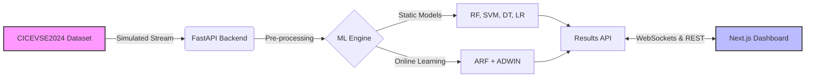

  
  
  

    <b>A robust, real-time Intrusion Detection System (IDS) for Electric Vehicle Charging Station (EVCS) networks.</b>
  

  

    
    
    
    
    
  

---

## ⚡ Overview

EVNet Sentinel reproduces and benchmarks the methods from Makhmudov et al. (2025) using the CICEVSE2024 dataset. It utilizes a combination of static Machine Learning classifiers and Online Learning (ARF + ADWIN) to detect anomalous network traffic in near real-time. 

Beyond the research, this project introduces a stunning, interactive Next.js dashboard as a modern engineering and HCI contribution!

## 🚀 Features

- 🧠 **Hybrid ML Pipeline**: Compare Static models (RF, SVM, LR, DT) with Adaptive Online models.
- ⚡ **Real-Time Detection**: WebSocket integration for instant anomaly alerts.
- 📊 **Interactive Dashboard**: Next.js-powered visualisations and live confusion matrices.
- 🛡️ **Cybersecurity-First**: Designed specifically for EVCS infrastructure vulnerabilities.

## 🏗️ Architecture

## 📚 Documentation

Detailed documentation has been separated into the `docs/` directory for better maintainability:

- 🏛️ [**Architecture Details**](./docs/ARCHITECTURE.md)
- ⚙️ [**Setup & Installation**](./docs/SETUP.md)
- 📚 [**Reference Papers Index**](./docs/papers.md)
- 📊 [**Dataset Feature Engineering**](./docs/dataset_feature_engineering.md)
- 📝 [**Implementation Plan**](./docs/implementation_plan_phase0_landing_page.md)
- 📄 [**Project SRS**](./docs/Project_SRS/WDL_SRS_EVNetSentinel.pdf)

## 🔐 Dataset Access & Security Rules

The CICEVSE2024 dataset used for this project is heavy and access-restricted. Please follow these rules:
1. **Never commit the dataset**: All dataset archives and CSV files (`*.tar.xz`, `*.zip`, `*.csv`) are strictly ignored in `.gitignore`. Do NOT bypass this rule.
2. **Secure the URL**: The Google Drive URL for the dataset must never be hardcoded in the codebase or public documentation. 
3. **Local Setup**: 
   - Copy `.env.example` to `.env` in the root directory.
   - Add the Google Drive URL (provided by the team admin) to your `.env` file under `CICEVSE2024_DATASET_URL`.
   - The `.env` file is also ignored by Git.

## 👥 Meet The Team

| Roll No. | Name | Official Role Title | GitHub |
|----------|------|---------------------|--------|
| **24102A0013** | Mukta Varak | Cloud Deployment & Backend API | [@Mukta01](https://github.com/Mukta01) |
| **24102A0018** | Shruti Chaurasiya | Data Visualization & Testing QA | [@shrutich-30](https://github.com/shrutich-30) |
| **24102A0021** | Shardul Chogale | ML Pipelining & Model Evaluation | [@shard-c6](https://github.com/shard-c6) |
| **24102A0022** | Neha Chavhan | Frontend UI & Real-Time Integration | [@nehachavhan2006](https://github.com/nehachavhan2006) |

---

  <i>Created for Software Engineering academic requirements.</i>

