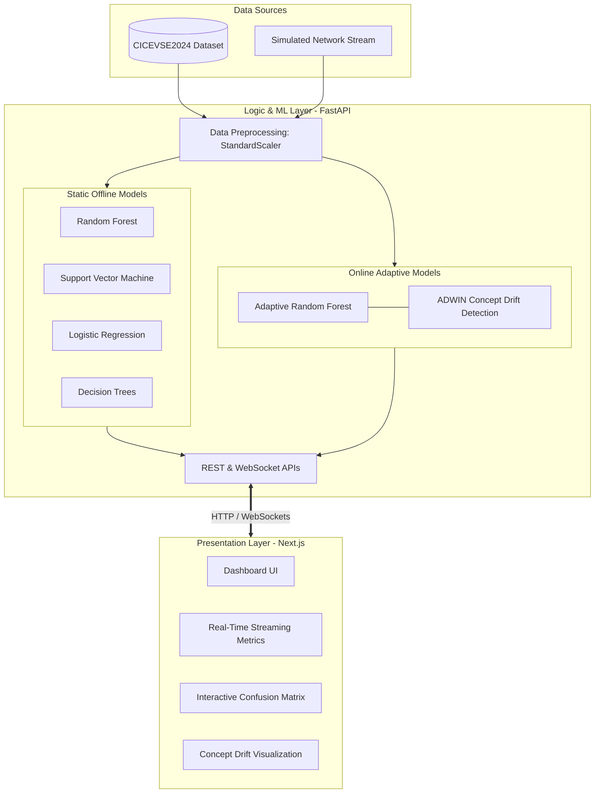

# Architecture Overview

EVNet Sentinel is built on a decoupled, two-tier architecture to separate the intensive Machine Learning pipeline from the interactive presentation layer. The system design is heavily informed by recent research in EVCS cybersecurity, specifically the online learning methodologies proposed by Makhmudov et al. (2025).

---

## 1. System Diagram

---

## 2. Core Components

### 2.1 The Data Layer: CICEVSE2024 Dataset
The foundation of the project is the **CICEVSE2024 dataset**, generated by the Canadian Institute for Cybersecurity. 
- **Type**: Flow-level network traffic.
- **Size**: ~1.2 million instances.
- **Classes**: 15 classes (1 Benign, 14 Attack types including DoS, FDIA, Reconnaissance, Backdoor, Cryptojacking).
- **Processing**: The backend simulates a real-time data stream by feeding instances from this dataset sequentially, mocking a live Network Tap at a charging station.

### 2.2 The Backend: FastAPI, Machine Learning Engine & Docker Deployment
The backend is a high-performance Python application utilizing `FastAPI`. It runs distinct Machine Learning pipelines to demonstrate the advantages of online learning. 

#### 1. Dynamic Model Loading
Instead of hardcoding model paths, the FastAPI backend features a **Dynamic Model Registry**. During startup, it actively scans the `/app/saved_models` directory and loads any available `.pkl` models (e.g., `rf_model_multiclass.pkl`, `svm_model_multiclass.pkl`, `arfadwin_model.pkl`). The loading mechanism is wrapped in robust `try/except` blocks to ensure fault tolerance—if a single model fails to load, the API continues to serve predictions from the remaining successful models.

#### 2. Single-Stage Docker Deployment
To ensure cross-platform compatibility and seamless production deployment, the entire backend is packaged inside a **Docker Container** (Epic 3). 
* **Rust/C++ Compatibility**: The deployment utilizes a **single-stage build process**. This ensures that critical C++ and Rust compilation artifacts (like `_river_rust`), which are required by the `river` streaming library for ARF-ADWIN, are preserved in the final image, preventing runtime dynamic library errors (`ModuleNotFoundError`).

#### Pipeline A: Static Offline Models (Baseline)
Uses `scikit-learn` to train traditional models (RF, SVM, LR, DT). 
* **Multiclass Simplification:** To prevent data memorization and overfitting, the binary classification targets were dropped. All static models exclusively perform **14-class multiclass classification** (13 attack types + 1 benign).
* **Out-of-Core Learning (Chunking):** To handle the massive scale of the CICEVSE2024 dataset (2.4+ GB processed), the architecture utilizes an Out-of-Core learning strategy for linear models (SVM, Logistic Regression) using `SGDClassifier` with `.partial_fit()`. Random Forest relies on optimized in-core training. 
* **Limitation:** While these achieve high raw accuracy on static data, they fail to adapt to evolving attack patterns (Concept Drift) in a live EVCS network environment.

#### Pipeline B: Online Adaptive Models (Primary Innovation)
Uses the `River` streaming machine learning framework, replicating the exact methodology from our primary reference paper.
- **Model**: Adaptive Random Forest (ARF) with 20 trees and a 50% feature subset.
- **Drift Detection**: ADWIN (Adaptive Windowing) with a significance delta of `0.002`.
- **Mechanism**: As network traffic streams in, the model predicts the class (Benign/Attack) and immediately updates its internal structure. If ADWIN detects a statistical shift in the data distribution (Concept Drift), the ensemble resets specific trees, allowing it to adapt to novel attacks without retraining from scratch.

### 2.3 The Frontend: Next.js Dashboard
A React-based `Next.js` application styled with `TailwindCSS` providing a modern, interactive SOC (Security Operations Center) experience.
- **WebSocket Integration**: Connects to the FastAPI backend to receive millisecond-level updates on predictions and network traffic.
- **Concept Drift Visualisation**: Actively monitors and graphs when ADWIN triggers a drift event, showing how the system adapts.
- **Dynamic Confusion Matrices**: Real-time evaluation of the model's performance as it processes the simulated network stream.

---

## 3. Protocol & Threat Landscape Focus
The architecture is designed to handle EVCS-specific protocols, including **OCPP** (Open Charge Point Protocol) and **ISO 15118** (V2G communication). 

By monitoring flow-level statistics of these protocols, EVNet Sentinel is capable of detecting:
1. **Denial of Service (DoS)**: Overwhelming the charging station network.
2. **Reconnaissance**: Port scanning and vulnerability probing.
3. **False Data Injection Attacks (FDIA)**: Manipulating energy pricing or charging state parameters.
4. **V2X Exploits**: Malicious payloads traversing from the vehicle to the broader grid infrastructure.
