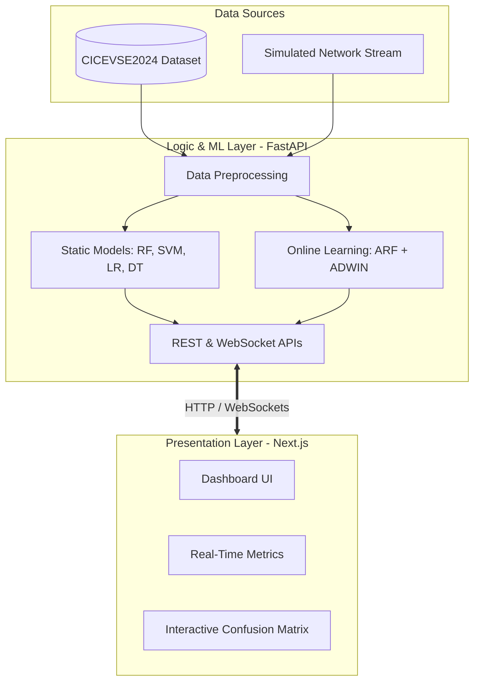

# Architecture Overview

EVNet Sentinel is built on a decoupled, two-tier architecture to separate the Machine Learning pipeline from the presentation layer.

## System Diagram

## Components

1. **Frontend**: A Next.js based dashboard utilizing React and TailwindCSS to provide an interactive interface. It connects to the backend via WebSockets for real-time anomaly alerts and uses standard REST endpoints for historical data fetching.
2. **Backend**: A FastAPI server that handles data ingestion, normalisation, and inference. It runs both static classifiers and online learning models in parallel to evaluate their performance against network intrusion attempts on the EVCS simulated network.
3. **Machine Learning Pipeline**: Uses Python's Scikit-learn for static models (Random Forest, SVM, Logistic Regression, Decision Trees) and River for online adaptive learning (Adaptive Random Forest with ADWIN concept drift detection).
