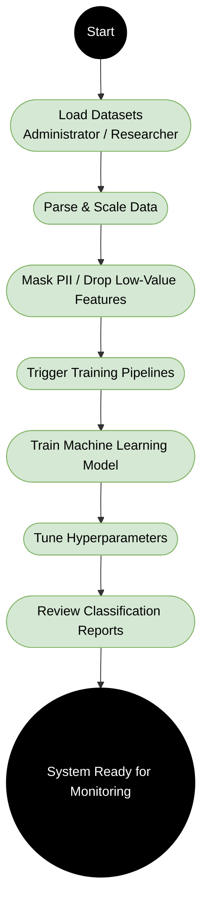
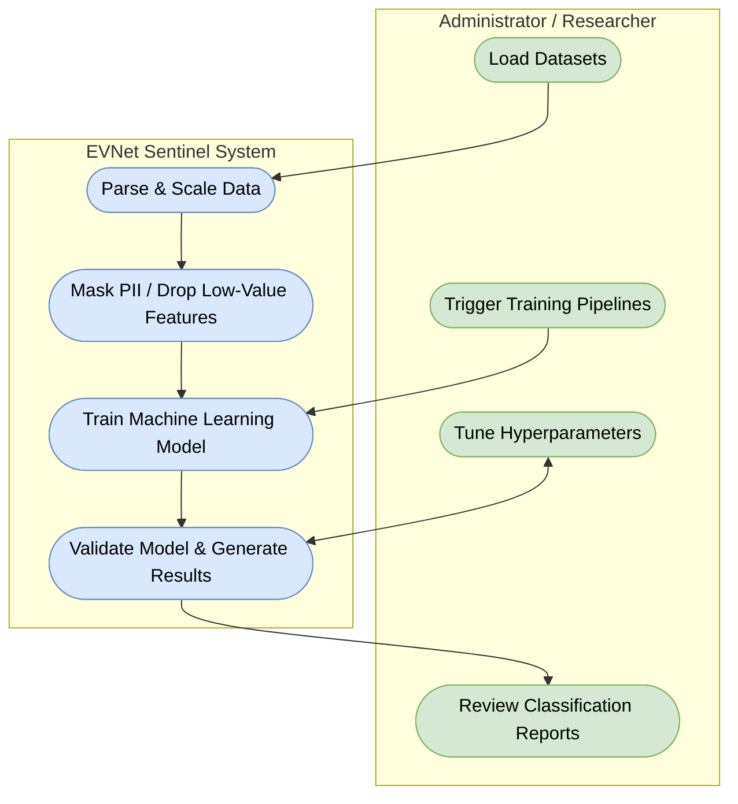

# EVNet Sentinel Activity Diagrams

Here are the Mermaid.js versions of the **Activity Diagram** and **Swimlane Diagram**, isolated specifically for the single use case: **Administrator / Researcher (Data Loading & Training Models)**.

## 1. Activity Diagram (Data Loading & Training)
This diagram maps the sequential flow of actions for preparing the data and training the models, ending when the system is ready for monitoring.

---

## 2. Swimlane Diagram (Data Loading & Training)
This diagram divides the same training workflow into its two core actors: the **Administrator / Researcher** and the **EVNet Sentinel System**.

