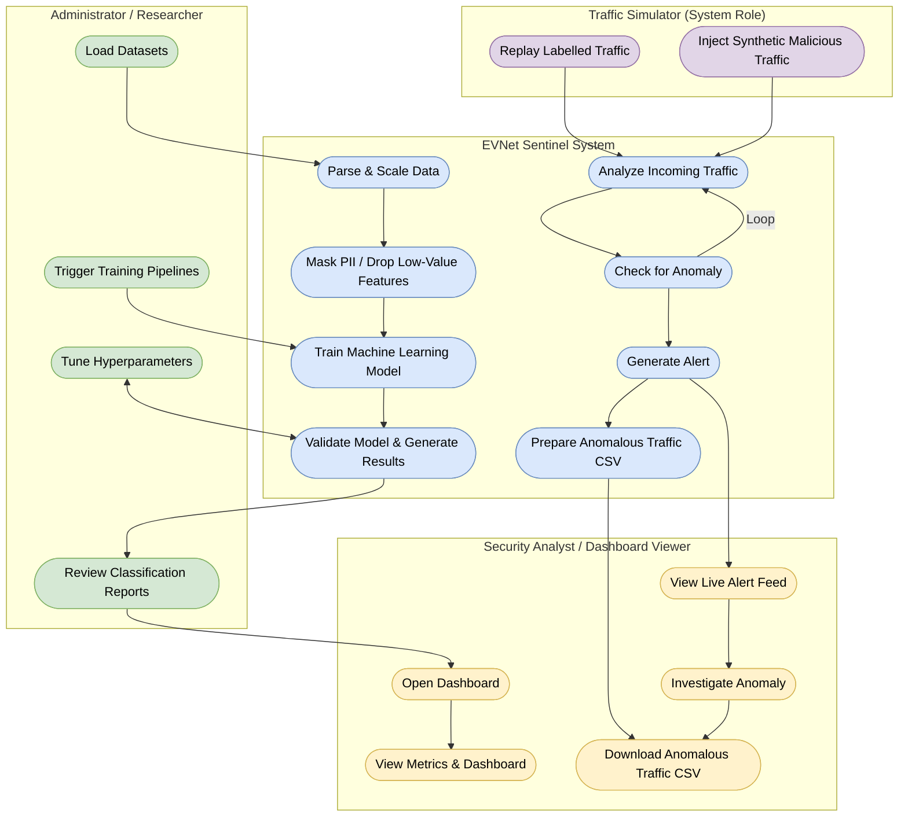

# EVNet Sentinel Activity Diagrams

Based on your uploaded diagram, here are the Mermaid.js versions of both the **Activity Diagram** and the **Swimlane Diagram**, mapping the entire end-to-end lifecycle of the system.

## 1. Activity Diagram (End-to-End Workflow)

This diagram maps the unified, sequential flow of the entire system as depicted in your image's left panel.

```mermaid
flowchart TD
    %% Define nodes
    Start(((Start)))
    A1([Load Datasets<br/>Administrator / Researcher])
    A2([Parse & Scale Data])
    A3([Mask PII / Drop Low-Value Features])
    A4([Trigger Training Pipelines])
    A5([Train Machine Learning Model])
    A6([Tune Hyperparameters])
    A7([Review Classification Reports])
    A8([System Ready for Monitoring])
    A9([Security Analyst Opens Dashboard])
    A10([View Dashboard & Metrics])
    A11([Traffic Simulator<br/>Replay / Inject Traffic])
    A12([System Analyzes Traffic])
    D1{Anomaly<br>Detected?}
    A13([Generate Alert<br/>View Live Alert Feed])
    A14([Investigate Anomaly])
    A15([Download Anomalous<br/>Traffic CSV if required])
    End(((End / Continue Monitoring)))

    %% Connections
    Start --> A1
    A1 --> A2
    A2 --> A3
    A3 --> A4
    A4 --> A5
    A5 --> A6
    A6 --> A7
    A7 --> A8
    A8 --> A9
    A9 --> A10
    A10 --> A11
    A11 --> A12
    A12 --> D1

    D1 -->|No| A10
    D1 -->|Yes| A13

    A13 --> A14
    A14 --> A15
    A15 --> End

    %% Styling
    style Start fill:#000,stroke:#000,color:#fff
    style End fill:#000,stroke:#000,stroke-width:2px,color:#fff

    %% Colors from image
    %% Green (Data Preparation & Training)
    classDef admin fill:#d5e8d4,stroke:#82b366,stroke-width:1px,color:#000
    class A1,A2,A3,A4,A5,A6,A7 admin

    %% Yellow (System Ready)
    style A8 fill:#fff2cc,stroke:#d6b656,stroke-width:1px,color:#000

    %% Blue (Monitoring & Analysis)
    classDef analyst fill:#dae8fc,stroke:#6c8ebf,stroke-width:1px,color:#000
    class A9,A10 analyst

    %% Purple (Simulation)
    style A11 fill:#e1d5e7,stroke:#9673a6,stroke-width:1px,color:#000

    %% Pink (System Processing / Alert)
    classDef system fill:#f8cecc,stroke:#b85450,stroke-width:1px,color:#000
    class A12,D1,A13,A14,A15 system
```

---

## 2. Swimlane Diagram (End-to-End Workflow)

This diagram maps the exact same flow but divides the actions into four dedicated columns: **Administrator**, **System**, **Security Analyst**, and **Traffic Simulator**, accurately mirroring the right panel of your image.

