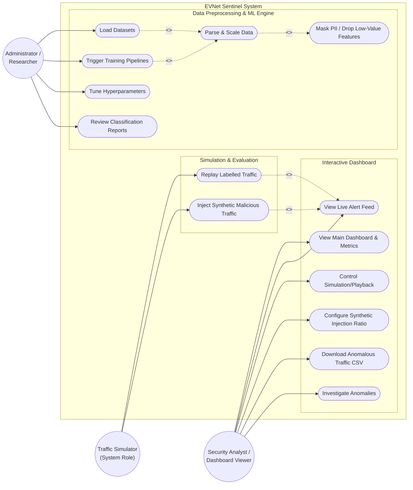

# EVNet Sentinel Use Case Diagram

Based on the provided Software Requirements Specification (SRS) (Version 1.2) for the EVNet Sentinel project, here is a detailed Use Case diagram. The diagram captures the primary actors (roles) specified in Section 2.3 and their respective use cases across the different subsystems of the project (Section 2.2 and Section 4).

## Roles and Responsibilities Breakdown:

1. **Administrator / Researcher**:
   - Focuses on the backend ML lifecycle.
   - Loads the CICEVSE2024 datasets.
   - Triggers the training pipelines for the static batch models (RF, SVM, LR, DT) and the online adaptive model (ARF with ADWIN).
   - Tunes hyperparameters to optimize performance.
   - Reviews offline classification reports.

2. **Security Analyst / Dashboard Viewer**:
   - Focuses on the Next.js/React frontend.
   - Interacts with the real-time alerting dashboard.
   - Controls the simulation playback (play/pause/speed).
   - Monitors the live alert feed, animated confusion matrix, and performance metrics.
   - Adjusts the injection ratio of synthetic attack traffic to test the system's robustness.
   - Downloads CSV logs of anomalous traffic for further investigation.

3. **Traffic Simulator (System Role)**:
   - An automated system actor that programmatically replays labelled traffic.
   - Injects supplementary synthetic malicious traffic into the data stream to evaluate the system's attack coverage and robustness (especially for handling flooding-style traffic).
