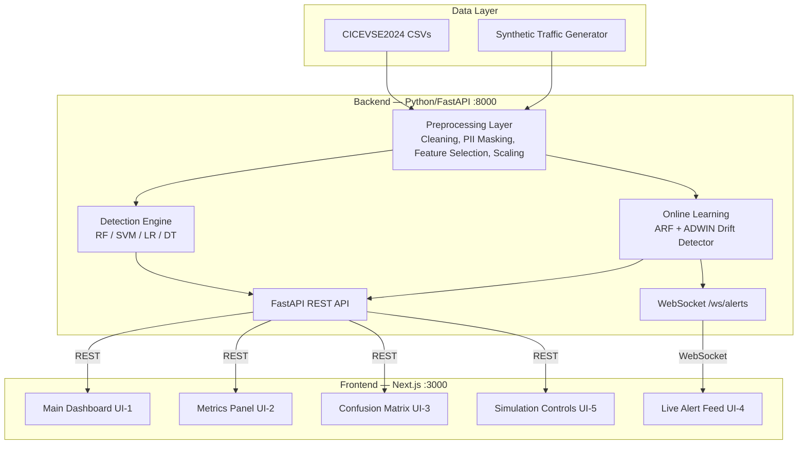

# EVNet Sentinel — Full Project Implementation Plan

## 🚨 Tomorrow's Mentor Meeting: Landing Page MUST Be Ready
**Deadline:** August 4, 2026 (your meeting)
**Current time:** Aug 4, 00:02 AM IST — we have **one working session tonight** to get this done.

---

## Understanding Summary

- **What:** An Intrusion Detection System (IDS) for Electric Vehicle Charging Station (EVCS) networks, combining static ML classifiers (RF, SVM, LR, DT) with an online learning model (ARF + ADWIN) on the CICEVSE2024 dataset.
- **Why:** Academic project (Software Engineering course) reproducing & benchmarking Makhmudov et al. (2025), adding an interactive animated dashboard as the engineering/HCI contribution.
- **Who:** 4 team members — Shardul (shard-c6), Mukta (Mukta01), + 2 TBD members.
- **Architecture:** Two-tier — Python/FastAPI backend (ML + API) ↔ Next.js/React/TypeScript frontend (dashboard), connected via REST + WebSocket.
- **Key Constraints:** Local-only deployment (`localhost:3000` ↔ `localhost:8000`), no GPU required, open-source stack only, CICEVSE2024 network-traffic subset only (no multi-modal fusion).
- **Non-goals:** Production deployment, multi-modal IDS, real-time live network capture.

---

## Project Architecture (from SRS v1.2)



---

## 🔥 PHASE 0: TONIGHT — Landing Page + Project Scaffold (Due: Before Meeting)

> [!CAUTION]
> This is the only phase we execute NOW. Everything else is planned but not started until after the mentor meeting.

### What the Landing Page Must Show

A polished, presentable **project landing page** that demonstrates:
1. **Project identity** — name, logo/branding, tagline
2. **Problem statement** — why EVCS cybersecurity matters
3. **Solution overview** — what EVNet Sentinel does (high-level)
4. **Architecture diagram** — visual showing the 2-tier system
5. **Team section** — 4 team members with roles
6. **Tech stack badges** — Python, FastAPI, Next.js, React, Tailwind, scikit-learn, etc.
7. **Project timeline/roadmap** — phases of work
8. **Navigation shell** — placeholder routes for Dashboard, Docs, About

### Tech Stack for Landing Page
- **Next.js 14+** with App Router (TypeScript)
- **Tailwind CSS** for styling
- **Framer Motion** for animations (as specified in SRS)
- Runs on `localhost:3000`

### File Structure to Create Tonight

```
EVNet_Sentinel/
├── frontend/                    # Next.js app
│   ├── app/
│   │   ├── layout.tsx          # Root layout + fonts + metadata
│   │   ├── page.tsx            # Landing page (hero, features, team, roadmap)
│   │   ├── globals.css         # Tailwind + custom design tokens
│   │   ├── dashboard/
│   │   │   └── page.tsx        # Placeholder dashboard route
│   │   └── docs/
│   │       └── page.tsx        # Placeholder docs route
│   ├── components/
│   │   ├── Navbar.tsx          # Top navigation
│   │   ├── Hero.tsx            # Hero section with animated text
│   │   ├── Features.tsx        # Problem + solution cards
│   │   ├── Architecture.tsx    # Architecture diagram section
│   │   ├── TechStack.tsx       # Technology badges
│   │   ├── Team.tsx            # Team member cards
│   │   ├── Roadmap.tsx         # Project timeline
│   │   └── Footer.tsx          # Footer with links
│   ├── package.json
│   ├── tsconfig.json
│   ├── tailwind.config.ts
│   └── next.config.mjs
├── backend/                     # Python FastAPI (scaffold only tonight)
│   ├── app/
│   │   ├── __init__.py
│   │   ├── main.py             # FastAPI app entry point (minimal)
│   │   └── config.py           # Configuration
│   ├── requirements.txt
│   └── README.md
├── README.md                    # Project-level README
└── .gitignore
```

---

## Team Work Division (Flexible Zones)

> [!IMPORTANT]
> These are **primary ownership zones**, not rigid silos. Everyone can (and should) contribute to any zone when needed. The "Owner" is the person responsible for driving progress and code quality in that zone.

### How Flexibility Works
- Each person has a **primary zone** (their main responsibility)
- Each person has a **secondary zone** (they actively support)
- **Any** team member can submit PRs to **any** zone
- Weekly rotation of secondary zones keeps everyone cross-trained

---

### 👤 Member 1: Shardul (shard-c6)
**Primary Zone:** 🎨 Frontend Core + Landing Page
**Secondary Zone:** 🔌 API Integration Layer

| Responsibility | Description |
|---|---|
| Landing page (TONIGHT) | Hero, features, team, architecture sections |
| Dashboard shell | Layout, navigation, routing |
| API client layer | Fetch hooks, WebSocket connection manager |
| Framer Motion animations | Alert pop-ins, metric transitions, matrix animations |
| Responsive design | Mobile + desktop layouts |

---

### 👤 Member 2: Mukta (Mukta01)
**Primary Zone:** 🤖 ML Pipeline + Data Engineering
**Secondary Zone:** 🖥️ Backend API

| Responsibility | Description |
|---|---|
| Data preprocessing | CICEVSE2024 loading, cleaning, PII masking, feature selection |
| Static classifiers | RF, SVM, LR, DT training, evaluation, cross-validation |
| Online learning | ARF + ADWIN implementation with River |
| Model persistence | joblib serialization, reproducibility (fixed seeds) |
| Benchmark comparison | Compare results against Makhmudov et al. (2025) targets |

---

### 👤 Member 3: [TBD — Name Needed]
**Primary Zone:** 🔌 Backend API + WebSocket
**Secondary Zone:** 🤖 ML Pipeline Support

| Responsibility | Description |
|---|---|
| FastAPI REST endpoints | `/api/models`, `/api/metrics`, `/api/predictions`, `/api/alerts` |
| WebSocket server | `/ws/alerts` live stream implementation |
| CORS + security | Localhost-restricted CORS (SEC-3) |
| API documentation | OpenAPI/Swagger spec (REQ-14) |
| Synthetic traffic generator | Configurable injection ratio via API (REQ-7) |
| CSV export endpoint | Alert/report CSV download (REQ-9) |

---

### 👤 Member 4: [TBD — Name Needed]
**Primary Zone:** 📊 Data Visualization + Testing
**Secondary Zone:** 🎨 Frontend Support

| Responsibility | Description |
|---|---|
| Chart components | Metrics panel (Recharts/visx), confusion matrix heatmap |
| Live alert feed UI | Animated real-time alert stream component |
| Simulation controls | UI-5: dataset selection, traffic injection ratio slider |
| End-to-end testing | Frontend unit tests, API contract tests |
| Documentation | README, embedded tooltips, dashboard help |

---

### Cross-Zone Collaboration Matrix

| | Frontend Core | ML Pipeline | Backend API | Viz + Testing |
|---|---|---|---|---|
| **Shardul** | 🟢 Primary | 🔵 Assist | 🟡 Secondary | 🔵 Assist |
| **Mukta** | 🔵 Assist | 🟢 Primary | 🟡 Secondary | 🔵 Assist |
| **Member 3** | 🔵 Assist | 🟡 Secondary | 🟢 Primary | 🔵 Assist |
| **Member 4** | 🟡 Secondary | 🔵 Assist | 🔵 Assist | 🟢 Primary |

🟢 = Primary Owner | 🟡 = Active Secondary | 🔵 = Can assist anytime

---

## Full Project Phases

### Phase 0: Project Setup + Landing Page ← **TONIGHT**
**Duration:** 1 session (tonight)
**Deliverable:** Running Next.js landing page + project scaffold

- [x] Understand SRS and architecture
- [ ] Initialize Next.js project in `frontend/`
- [ ] Build landing page (all 7 sections)
- [ ] Create backend scaffold in `backend/`
- [ ] Write project-level README.md
- [ ] Update `.gitignore`
- [ ] Push to GitHub

---

### Phase 1: Backend ML Pipeline (Week 1-2)
**Owner:** Mukta | **Support:** Member 3

- [ ] Set up Python environment + `requirements.txt`
- [ ] CICEVSE2024 data loading + exploratory analysis
- [ ] Preprocessing pipeline (cleaning, PII masking, feature selection via RFE)
- [ ] Train static classifiers (RF, SVM, LR, DT) with fixed seeds
- [ ] Implement ARF + ADWIN online learning with River
- [ ] Generate classification reports, confusion matrices
- [ ] Model serialization with joblib
- [ ] Unit tests for pipeline stages

---

### Phase 2: Backend API Layer (Week 2-3)
**Owner:** Member 3 | **Support:** Mukta

- [ ] FastAPI app structure + configuration
- [ ] REST endpoints:
  - `GET /api/status` — system health
  - `GET /api/models` — available models list
  - `GET /api/models/{id}/metrics` — per-model metrics
  - `GET /api/models/{id}/confusion-matrix` — confusion matrix data
  - `POST /api/simulation/start` — start traffic simulation
  - `GET /api/alerts` — paginated alert history
  - `GET /api/export/csv` — CSV download
- [ ] WebSocket endpoint: `/ws/alerts`
- [ ] CORS configuration (SEC-3: restrict to `localhost:3000`)
- [ ] OpenAPI/Swagger documentation (REQ-14)
- [ ] Synthetic traffic injection API (REQ-7)
- [ ] API tests

---

### Phase 3: Frontend Dashboard (Week 2-4)
**Owner:** Shardul + Member 4

- [ ] Dashboard layout with sidebar/top navigation
- [ ] API client hooks (`useFetch`, `useWebSocket`)
- [ ] UI-1: Main dashboard (status, dataset info, record count)
- [ ] UI-2: Metrics panel with animated value transitions (Framer Motion)
- [ ] UI-3: Animated confusion matrix (Recharts/visx heatmap)
- [ ] UI-4: Live alert feed (WebSocket → animated list)
- [ ] UI-5: Simulation controls (dataset picker, injection ratio slider)
- [ ] Embedded tooltips for ML metrics (dashboard help)
- [ ] CSV export button (calls backend API)
- [ ] Responsive design pass

---

### Phase 4: Integration + Testing (Week 4-5)
**All team members**

- [ ] End-to-end integration (frontend ↔ backend ↔ ML pipeline)
- [ ] Performance benchmarks:
  - Inference latency < 5ms (PR-1)
  - REST < 300ms, WS < 200ms (PR-4)
  - UI animations 30-60 fps (PR-3)
  - Dashboard first render < 3s (UI-1 acceptance)
- [ ] Reproducibility verification (REQ-10, REQ-11, REQ-12)
- [ ] Security audit (SAF-1: no live network egress, SEC-3: CORS)
- [ ] API/frontend consistency checks

---

### Phase 5: Documentation + Submission (Week 5)
**All team members**

- [ ] Final README with setup instructions (both tiers)
- [ ] API contract documentation
- [ ] Benchmark comparison table vs. Makhmudov et al. (2025)
- [ ] Code cleanup + modularity review
- [ ] Demo recording / preparation

---

## Open Questions for Team Discussion

> [!IMPORTANT]
> These should be discussed at tomorrow's mentor meeting.

1. **Charting library:** Recharts (simpler) vs. visx/D3.js (more flexible)? SRS lists this as TBD-4.
2. **WebSocket implementation:** FastAPI native WebSocket vs. `python-socketio` + `socket.io-client`? SRS lists this as TBD-5.
3. **Dataset access:** Has the CICEVSE2024 dataset been downloaded and placed locally? If not, who handles this?
4. **Deployment scope:** Strictly `localhost` for grading, or also deploy frontend to Vercel for demo convenience? (TBD-2)
5. **Feature count post-RFE:** How many features to retain? (TBD-1)
6. **Names of Members 3 and 4:** Need to finalize team roster and add as GitHub collaborators.

---

## Decision Log

| # | Decision | Alternatives Considered | Rationale |
|---|---|---|---|
| D-1 | Next.js 14+ with App Router for frontend | Pages Router, Vite+React, Astro | SRS mandates Next.js; App Router is current standard |
| D-2 | Tailwind CSS for styling | Vanilla CSS, CSS Modules | SRS explicitly specifies Tailwind CSS |
| D-3 | Framer Motion for animations | CSS transitions, GSAP, React Spring | SRS explicitly specifies Framer Motion |
| D-4 | FastAPI for backend | Flask, Django, Express | SRS recommends FastAPI for native WebSocket + async |
| D-5 | Monorepo structure (`frontend/` + `backend/`) | Separate repos | Simpler for academic project, single repo already exists |
| D-6 | Flexible role zones over rigid assignments | Waterfall task assignment | Better for a 4-person academic team; cross-training |
| D-7 | Landing page as Phase 0 priority | Start with ML pipeline | Mentor meeting tomorrow requires visible frontend |

---

## Verification Plan

### Automated Tests
```bash
# Frontend
cd frontend && npm run build    # Catches TypeScript/build errors
cd frontend && npm run lint     # ESLint checks

# Backend
cd backend && python -m pytest  # Unit tests
cd backend && python -m pytest tests/test_api.py  # API tests
```

### Manual Verification
- Landing page visually inspected in browser at `localhost:3000`
- All 7 sections render correctly on desktop and mobile
- Navigation links work (Dashboard, Docs routes exist)
- Backend health check at `localhost:8000/api/status`

---

## Immediate Next Step

> [!CAUTION]
> **If you approve this plan, I will immediately build the landing page + project scaffold (Phase 0) so it's ready before your meeting tomorrow.**

This includes:
1. Initialize the Next.js project in `frontend/`
2. Build a stunning, animated landing page with all 7 sections
3. Scaffold the FastAPI backend in `backend/`
4. Create the project README
5. Everything committed and ready to push
