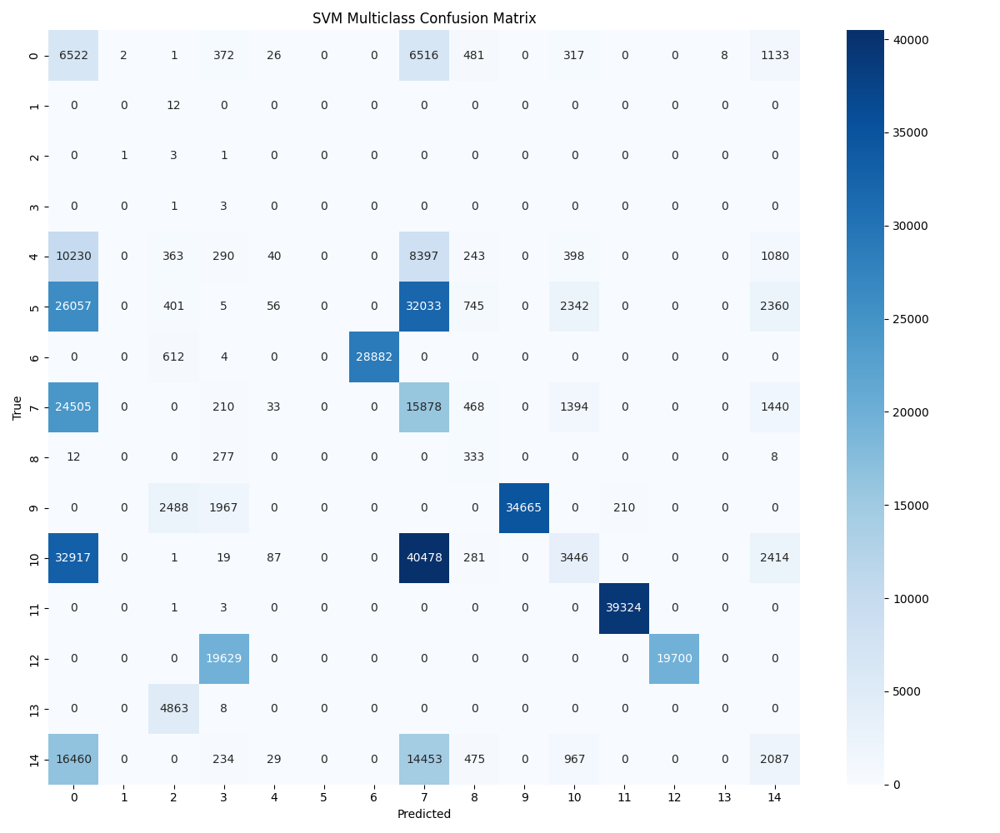

# Evaluation Summary: SVM (Multiclass)

**Classification Type**: Multiclass (15 Classes)
**Algorithm**: Support Vector Machine (Out-of-Core `SGDClassifier` with `loss='hinge'`)

## Overall Metrics
- **Accuracy**: 0.3665
- **Macro F1-Score**: 0.2829
- **Weighted F1-Score**: 0.3674

## Detailed Classification Report
```text
                    precision    recall  f1-score   support

   aggressive-scan       0.06      0.42      0.10     15378
            benign       0.00      0.00      0.00        12
        icmp-flood       0.00      0.60      0.00         5
icmp-fragmentation       0.00      0.75      0.00         4
 os-fingerprinting       0.15      0.00      0.00     21041
         port-scan       0.00      0.00      0.00     63999
    push-ack-flood       1.00      0.98      0.99     29498
 service-detection       0.13      0.36      0.20     43928
    slowloris-scan       0.11      0.53      0.18       630
         syn-flood       1.00      0.88      0.94     39330
       syn-stealth       0.39      0.04      0.08     79643
     synonymous-ip       0.99      1.00      1.00     39328
         tcp-flood       1.00      0.50      0.67     39329
         udp-flood       0.00      0.00      0.00      4871
vulnerability-scan       0.20      0.06      0.09     34705

          accuracy                           0.37    411701
         macro avg       0.34      0.41      0.28    411701
      weighted avg       0.47      0.37      0.37    411701

```

## Confusion Matrix


---

## Technical Challenges & Resolutions (Epic 2)

During the implementation and training of the baseline Static ML models, we encountered severe technical bottlenecks due to the sheer scale of the CICEVSE2024 flow-level dataset.

### Challenge 1: Out-Of-Memory (OOM) Errors
**The Problem**: The dataset comprises roughly 2.74 Million records and expands to 2.4+ GB when loaded into a dense pandas dataframe. Attempting to fit standard `scikit-learn` algorithms (e.g., `LinearSVC` with `OneVsRestClassifier`) caused catastrophic Memory/RAM crashes (spiking over 50 GB), freezing the host machine.
**The Solution**: We completely abandoned In-Core algorithms and transitioned the architecture to **Out-of-Core Learning**. We rewrote the training logic to use `SGDClassifier` and streamed the data in chunks of 100,000 using `pd.read_csv(chunksize=100000)`. By calling `.partial_fit()` on each batch, we strictly bounded the memory usage to under 500 MB while successfully training on the entire 1.9M row train split in under 10 seconds.

### Challenge 2: Extreme Class Imbalance
**The Problem**: The CICEVSE2024 dataset is heavily imbalanced, acting effectively as an anomalous dataset. The training set (1.92M rows) contained only 58 'Benign' samples, meaning 99.99% of the traffic was attacks. Initially, the model mathematically optimized itself by predicting all traffic as an attack, achieving 99.99% accuracy but entirely failing to identify the benign class.
**The Solution**: We addressed this by pre-computing exact mathematical class frequencies and passing `class_weight='balanced'` explicitly into the `SGDClassifier`. This forced the optimization function to heavily penalize misclassifications on the rare 'Benign' class and rare attack vectors, preventing the model from lazily predicting the majority class.

### Challenge 3: Redundancy of Binary Classification
**The Problem**: Because 99.99% of the labels were 'Attack', a Binary classifier (Attack vs Benign) yielded practically zero actionable intelligence in a Security Operations Center (SOC) dashboard. 
**The Solution**: In adherence with our Agile methodology, we pivoted our strategy. We removed the Binary classification requirements entirely from Epic 2 and streamlined our models to predict strictly the Multiclass labels (identifying the specific *type* of attack), which is significantly more valuable for threat mitigation.
