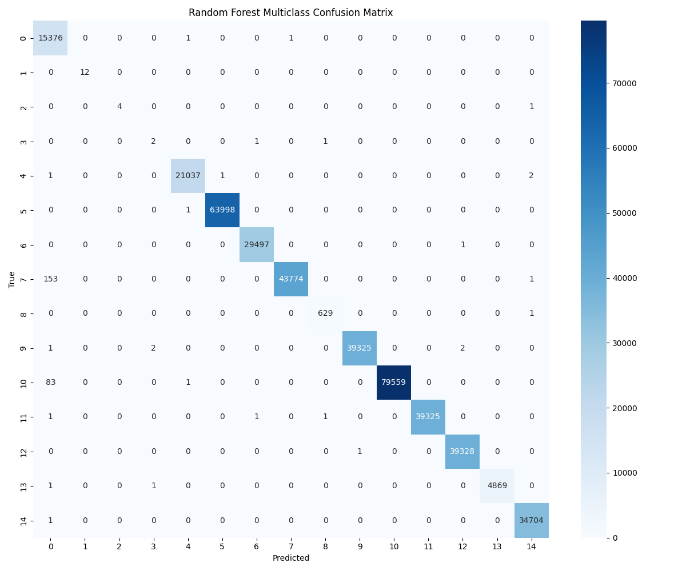

# Evaluation Summary: Random Forest (Multiclass)

**Classification Type**: Multiclass (15 Classes)
**Algorithm**: Random Forest Classifier

## Overall Metrics
- **Accuracy**: 0.9994
- **Macro F1-Score**: 0.9547
- **Weighted F1-Score**: 0.9994

## Detailed Classification Report
```text
                    precision    recall  f1-score   support

   aggressive-scan       0.98      1.00      0.99     15378
            benign       1.00      1.00      1.00        12
        icmp-flood       1.00      0.80      0.89         5
icmp-fragmentation       0.40      0.50      0.44         4
 os-fingerprinting       1.00      1.00      1.00     21041
         port-scan       1.00      1.00      1.00     63999
    push-ack-flood       1.00      1.00      1.00     29498
 service-detection       1.00      1.00      1.00     43928
    slowloris-scan       1.00      1.00      1.00       630
         syn-flood       1.00      1.00      1.00     39330
       syn-stealth       1.00      1.00      1.00     79643
     synonymous-ip       1.00      1.00      1.00     39328
         tcp-flood       1.00      1.00      1.00     39329
         udp-flood       1.00      1.00      1.00      4871
vulnerability-scan       1.00      1.00      1.00     34705

          accuracy                           1.00    411701
         macro avg       0.96      0.95      0.95    411701
      weighted avg       1.00      1.00      1.00    411701

```

## Confusion Matrix


---

## Technical Context (Random Forest)
By removing the Binary classification step (which was heavily biased by the 99.99% attack traffic), we focus entirely on the actionable intelligence of categorizing attack types. Random Forest is a non-linear ensemble model, which is expected to perform significantly better than our linear baseline (SVM) on this complex network traffic dataset.
